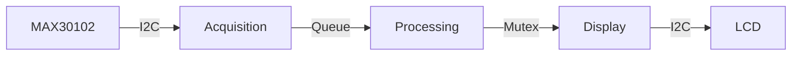
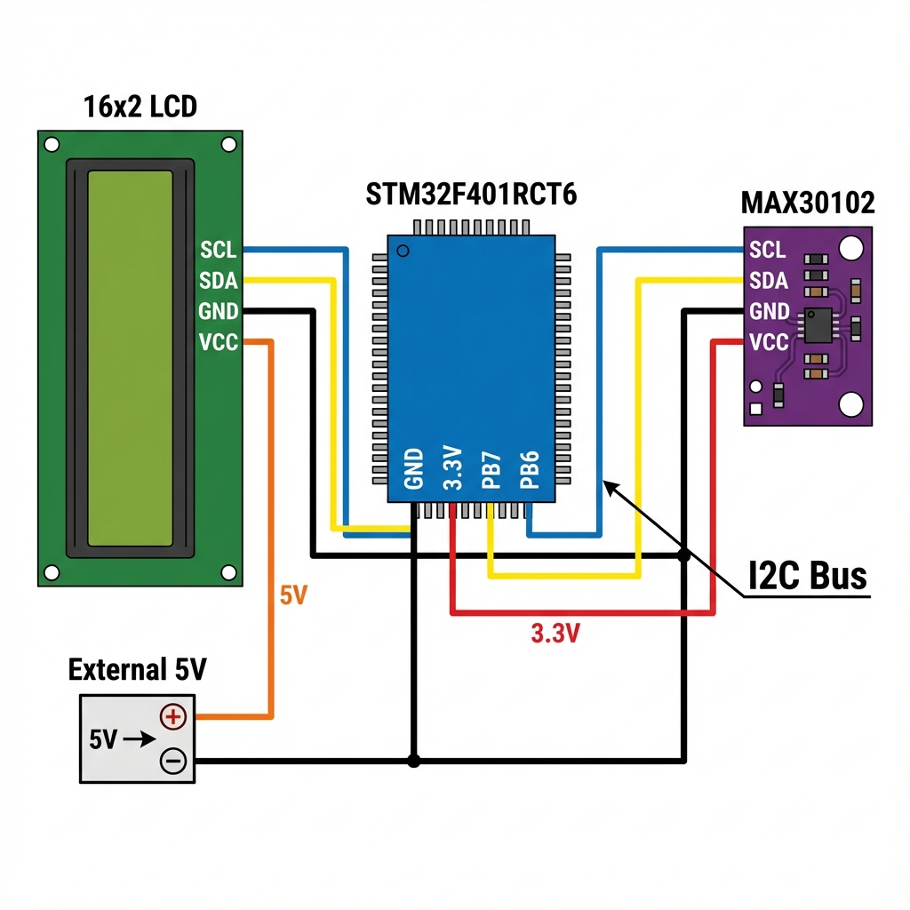
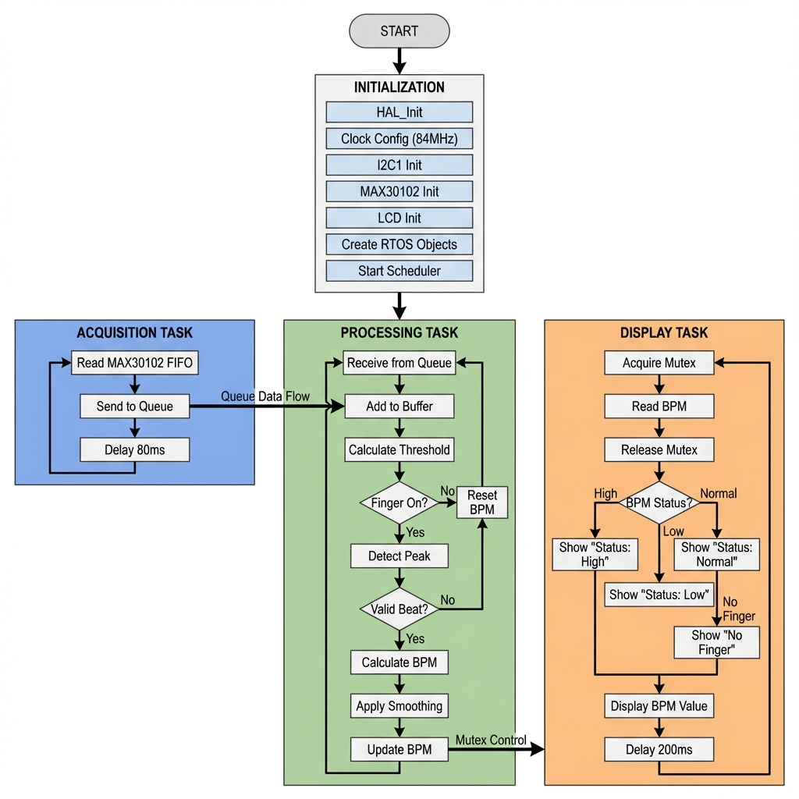

# Real-Time Heartbeat Monitoring System
## Presentation

---

# Slide 1: Title

## Real-Time Heartbeat Monitoring System
### Using STM32 + FreeRTOS + MAX30102

**Project Overview:**
- Real-time heart rate measurement
- Multi-tasking with FreeRTOS
- I2C sensor and LCD integration

---

# Slide 2: Purpose

## Why This Project?

1. **Learn Real-Time Systems** - FreeRTOS multi-tasking
2. **Signal Processing** - Adaptive heart rate algorithm
3. **Hardware Integration** - I2C communication
4. **Practical Application** - Biomedical monitoring

---

# Slide 3: Hardware Components

## Components Used

| Component | Model | Function |
|-----------|-------|----------|
| MCU | STM32F401RCT6 | ARM Cortex-M4, 84MHz |
| Sensor | MAX30102 | PPG heart rate sensor |
| Display | 16x2 LCD | User interface |
| Power | External 5V | LCD power supply |

---

# Slide 4: System Architecture

## 3-Task FreeRTOS Design

```
┌─────────────────┐    Queue    ┌──────────────────┐   Mutex   ┌─────────────────┐
│ Acquisition     │ ──────────► │ Processing       │ ◄───────► │ Display         │
│ Task            │             │ Task             │           │ Task            │
│                 │             │                  │           │                 │
│ • Read Sensor   │             │ • Calculate BPM  │           │ • Show Status   │
│ • 12.5Hz Sample │             │ • Peak Detection │           │ • Update LCD    │
└─────────────────┘             └──────────────────┘           └─────────────────┘
```

---

# Slide 5: Data Flow

## Process Overview



**Key Points:**
- Queue: Transfers raw samples
- Mutex: Protects shared BPM variable

---

# Slide 6: Heart Rate Algorithm

## Signal Processing Pipeline

1. **Hardware Averaging** - 8 samples averaged in sensor
2. **Circular Buffer** - 50 samples for threshold
3. **Dynamic Threshold** - 85% of amplitude
4. **Adaptive Lockout** - 65% of beat interval
5. **Smoothing** - 80% old + 20% new

---

# Slide 7: Key Code - Acquisition Task

## Reading Sensor Data

```c
void StartAcquisitionTask(void *argument)
{
  for(;;)
  {
    MAX30102_ReadFIFO(&red_val, &ir_val);
    osMessageQueuePut(rawDataQueueHandle, &ir_val, 0, 0);
    osDelay(80); // 12.5Hz
  }
}
```

---

# Slide 8: Key Code - Processing Task

## BPM Calculation

```c
// Peak detection with adaptive lockout
if (raw_ir > threshold) {
    uint32_t delta = HAL_GetTick() - last_beat_time;
    float instant_bpm = 60000.0f / delta;
    
    // Smoothing
    bpm = (bpm * 0.8f) + (instant_bpm * 0.2f);
    
    last_beat_time = HAL_GetTick();
}
```

---

# Slide 9: Key Code - Display Task

## LCD Update with Mutex

```c
void StartDisplayTask(void *argument)
{
  for(;;)
  {
    osMutexAcquire(bpmMutexHandle, osWaitForever);
    float display_bpm = bpm;
    osMutexRelease(bpmMutexHandle);
    
    // Show status on LCD
    lcd_send_string("BPM: 75");
    osDelay(200); // 5Hz
  }
}
```

---

# Slide 10: LCD Display States

## User Interface

| Status | Condition | Display |
|--------|-----------|---------|
| **High** | BPM > 100 | "Status: High" |
| **Normal** | 60 ≤ BPM ≤ 100 | "Status: Normal" |
| **Low** | BPM < 60 | "Status: Low" |
| **Idle** | No finger | "No Finger" |

---

# Slide 11: Development Steps

## Project Timeline

| Step | Task |
|------|------|
| 1 | STM32CubeMX setup |
| 2 | MAX30102 driver |
| 3 | LCD driver |
| 4 | Single task prototype |
| 5 | Split into 3 tasks |
| 6 | Add Queue & Mutex |
| 7 | Implement algorithm |
| 8 | Testing & tuning |

---

# Slide 12: Connection Diagram

## Hardware Wiring



**I2C Bus (Shared):**
- PB6 → SCL (Clock)
- PB7 → SDA (Data)

---

# Slide 13: Flowchart

## System Operation



---

# Slide 14: Challenges & Solutions

## Problems Encountered

| Problem | Solution |
|---------|----------|
| Double-counting beats | Adaptive lockout (65% interval) |
| Noisy signal | 8x hardware averaging |
| High BPM readings | Dynamic threshold (85%) |
| Data race on BPM | Mutex protection |

---

# Slide 15: Conclusion

## Summary

This project demonstrates:

- ✅ **FreeRTOS Multi-Tasking** (3 tasks)
- ✅ **Inter-Task Communication** (Queue + Mutex)
- ✅ **I2C Integration** (Sensor + LCD)
- ✅ **Signal Processing** (Adaptive algorithm)
- ✅ **Real-Time Display** (5Hz update)

---

# Slide 16: Thank You

## Questions?

**Project Files:**
- `main.c` - FreeRTOS tasks
- `max30102.c` - Sensor driver
- `i2c-lcd.c` - LCD driver

---
