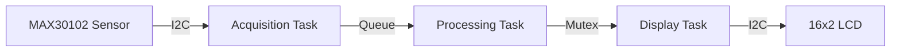
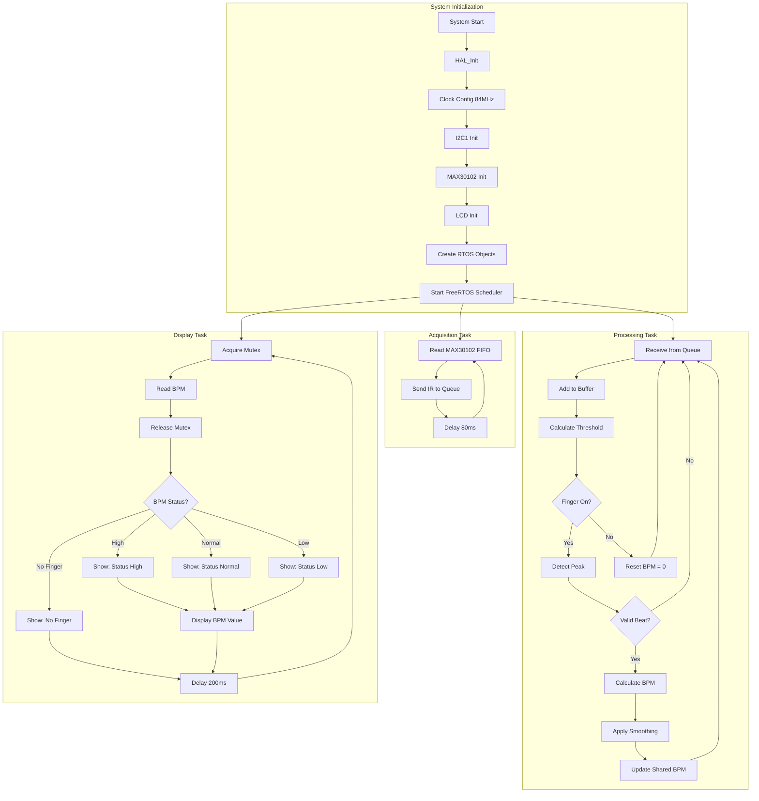

# Real-Time Heartbeat Monitoring System

## Project Report

---

## 1. Introduction

This project implements a **Real-Time Heartbeat Monitoring System** using an STM32F401RCT6 microcontroller, MAX30102 pulse oximeter sensor, and a 16x2 I2C LCD display. The system is built on **FreeRTOS** to demonstrate real-time operating system concepts including multi-tasking, inter-task communication, and resource synchronization.

---

## 2. Purpose

The purpose of this project is to:

1. **Demonstrate Real-Time Systems**: Implement a multi-tasking application using FreeRTOS with proper task synchronization
2. **Apply Signal Processing**: Develop an adaptive heart rate detection algorithm using dynamic thresholding
3. **Integrate Hardware Peripherals**: Interface with I2C devices (MAX30102 sensor and LCD display)
4. **Implement Safety Features**: Detect abnormal heart rate conditions and display appropriate alerts

---

## 3. Process Overview

The system operates in three concurrent stages:



| Stage | Description |
|-------|-------------|
| **1. Data Acquisition** | Read raw PPG samples from MAX30102 at 12.5Hz |
| **2. Signal Processing** | Apply filtering, peak detection, and BPM calculation |
| **3. Display Output** | Show status and BPM value on LCD at 5Hz |

---

## 4. Code Flowchart



---

## 5. Code

### 5.1 Main Application Structure (main.c)

```c
/* FreeRTOS Task Definitions */
osThreadId_t AcquisitionTaskHandle;
osThreadId_t ProcessingTaskHandle;
osThreadId_t DisplayTaskHandle;

/* Inter-Task Communication */
osMessageQueueId_t rawDataQueueHandle;
osMutexId_t bpmMutexHandle;

/* Shared Variables */
uint32_t ir_val = 0;
float bpm = 0.0f;
uint32_t ir_buffer[50];  // Circular buffer for filtering
```

### 5.2 Acquisition Task

```c
void StartAcquisitionTask(void *argument)
{
  for(;;)
  {
    MAX30102_ReadFIFO(&red_val, &ir_val);
    osMessageQueuePut(rawDataQueueHandle, &ir_val, 0, 0);
    osDelay(80); // 12.5Hz sampling
  }
}
```

### 5.3 Processing Task (Core Algorithm)

```c
void StartProcessingTask(void *argument)
{
  uint32_t raw_ir;
  static uint32_t adaptive_lockout = 700;
  
  for(;;)
  {
    if (osMessageQueueGet(rawDataQueueHandle, &raw_ir, NULL, 100) == osOK) {
        
        // Add to circular buffer
        ir_buffer[buffer_idx] = raw_ir;
        buffer_idx = (buffer_idx + 1) % BUFFER_SIZE;
        
        // Calculate dynamic threshold (85% of amplitude)
        uint32_t threshold = min_val + (amplitude * 85 / 100);
        
        // Peak detection with adaptive lockout
        if (raw_ir > threshold && (HAL_GetTick() - last_beat_time > adaptive_lockout)) {
            uint32_t delta = HAL_GetTick() - last_beat_time;
            float instant_bpm = 60000.0f / delta;
            
            // Update adaptive lockout (65% of interval)
            adaptive_lockout = (delta * 65) / 100;
            
            // Update BPM with mutex protection
            osMutexAcquire(bpmMutexHandle, osWaitForever);
            bpm = (bpm * 0.8f) + (instant_bpm * 0.2f);
            osMutexRelease(bpmMutexHandle);
            
            last_beat_time = HAL_GetTick();
        }
    }
  }
}
```

### 5.4 Display Task

```c
void StartDisplayTask(void *argument)
{
  char buf[32];
  for(;;)
  {
    // Read BPM safely
    osMutexAcquire(bpmMutexHandle, osWaitForever);
    float display_bpm = bpm;
    osMutexRelease(bpmMutexHandle);
    
    // Display status
    lcd_put_cur(0, 0);
    if (display_bpm > 100)
        snprintf(buf, 32, "Status: High    ");
    else if (display_bpm < 60)
        snprintf(buf, 32, "Status: Low     ");
    else
        snprintf(buf, 32, "Status: Normal  ");
    lcd_send_string(buf);
    
    // Display BPM value
    lcd_put_cur(1, 0);
    snprintf(buf, 32, "BPM: %lu        ", (uint32_t)display_bpm);
    lcd_send_string(buf);
    
    osDelay(200); // 5Hz update
  }
}
```

### 5.5 MAX30102 Driver (max30102.c)

```c
void MAX30102_Init(I2C_HandleTypeDef *hi2c) {
    // Reset sensor
    MAX30102_WriteReg(REG_MODE_CONFIG, 0x40);
    HAL_Delay(100);
    
    // FIFO Config: 8x sample averaging
    MAX30102_WriteReg(REG_FIFO_CONFIG, 0x6F);
    
    // SpO2 mode, 100Hz, 411μs pulse
    MAX30102_WriteReg(REG_MODE_CONFIG, 0x03);
    MAX30102_WriteReg(REG_SPO2_CONFIG, 0x27);
    
    // LED current: 7.2mA
    MAX30102_WriteReg(REG_LED1_PA, 0x24);
    MAX30102_WriteReg(REG_LED2_PA, 0x24);
}

void MAX30102_ReadFIFO(uint32_t *red_led, uint32_t *ir_led) {
    uint8_t data[6];
    MAX30102_ReadRegs(REG_FIFO_DATA, data, 6);
    
    // IR first, then RED (SpO2 mode)
    *ir_led  = ((data[0] & 0x03) << 16) | (data[1] << 8) | data[2];
    *red_led = ((data[3] & 0x03) << 16) | (data[4] << 8) | data[5];
}
```

---

## 6. Code Development Steps

| Step | Description | Key Files Modified |
|------|-------------|-------------------|
| **1** | STM32CubeMX project setup with I2C1 and FreeRTOS | `main.c`, `.ioc` |
| **2** | Implemented MAX30102 driver with register configuration | `max30102.c`, `max30102.h` |
| **3** | Implemented I2C LCD driver | `i2c-lcd.c`, `i2c-lcd.h` |
| **4** | Created single HeartbeatTask for initial testing | `main.c` |
| **5** | Split into 3 tasks: Acquisition, Processing, Display | `main.c` |
| **6** | Added Message Queue for Acquisition → Processing | `main.c` |
| **7** | Added Mutex for shared BPM variable protection | `main.c` |
| **8** | Implemented dynamic threshold algorithm | `main.c` |
| **9** | Added adaptive lockout to prevent double-counting | `main.c` |
| **10** | Integrated 8x hardware sample averaging | `max30102.c` |
| **11** | Fixed FIFO byte order (IR/RED swap) | `max30102.c` |
| **12** | Added status display (High/Normal/Low) | `main.c` |

---

## 7. Hardware Configuration

| Component | Configuration |
|-----------|---------------|
| **MCU Clock** | 84 MHz (HSI + PLL) |
| **I2C Speed** | 100 kHz (Standard Mode) |
| **MAX30102 Address** | 0x57 |
| **LCD Address** | 0x27 |
| **Sample Rate** | 12.5 Hz (100Hz / 8 averaging) |

---

## 8. Conclusion

This project successfully demonstrates the implementation of a real-time heartbeat monitoring system using FreeRTOS on an STM32F401RCT6 microcontroller. The system showcases key real-time operating system concepts including multi-tasking with three concurrent tasks (Acquisition, Processing, and Display), inter-task communication using Message Queues and Mutexes, and proper resource synchronization. The MAX30102 pulse oximeter sensor is integrated via I2C protocol with 8x hardware sample averaging for noise reduction, while an adaptive signal processing algorithm with dynamic thresholding ensures accurate heart rate detection. The 16x2 LCD display provides a user-friendly interface showing real-time BPM values along with status classification (High/Normal/Low). This project serves as a practical demonstration of embedded systems design, combining hardware interfacing, real-time software architecture, and digital signal processing in a cohesive biomedical application.

---

## Appendix: Connection Diagram


